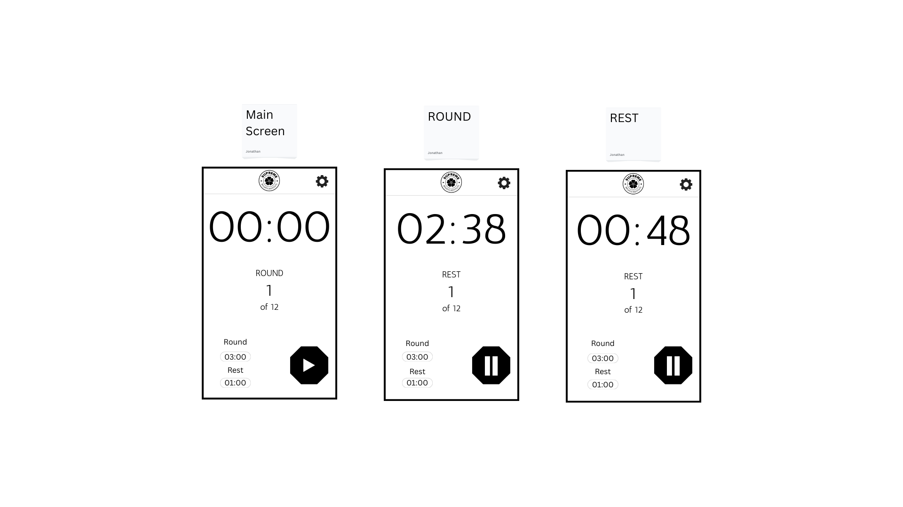

# Boxing PWA

This repo contains a little experiment. I want to rebuild an existing android app as a PWA.
Boxing timer with some boxing specific settings, intervals, sounds etc for our boxing gym.

## Design Aim

## Installation

1. Clone the repo
2. Run `npm install`
3. Run `npm run dev` to start the development server

## Additional npm Commands

- `npm run build` &mdash; Build the project for production.
- `npm run preview` &mdash; Preview the production build locally.
- `npm run format` &mdash; Format code using Prettier.
- `npm run dev:network` &mdash; Start the dev server accessible on your local network.
